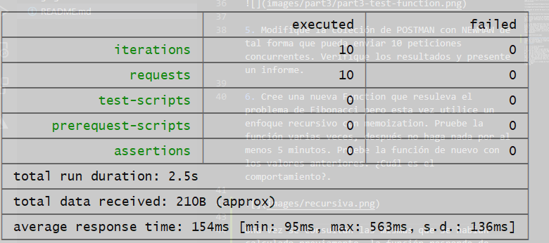
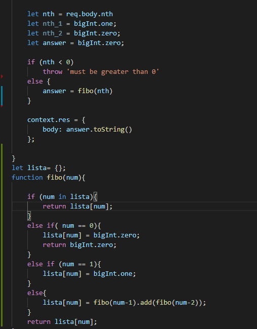
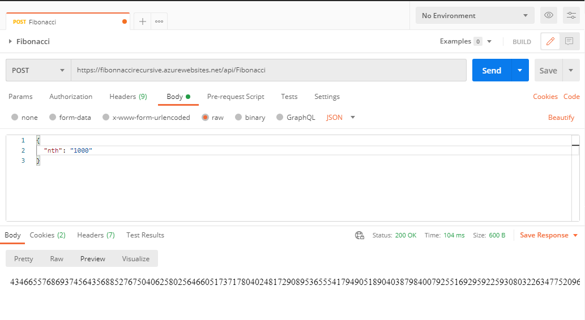
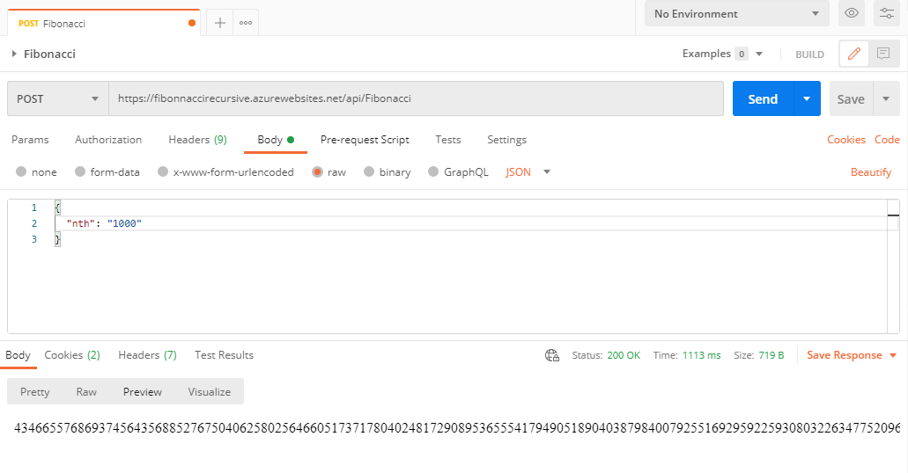
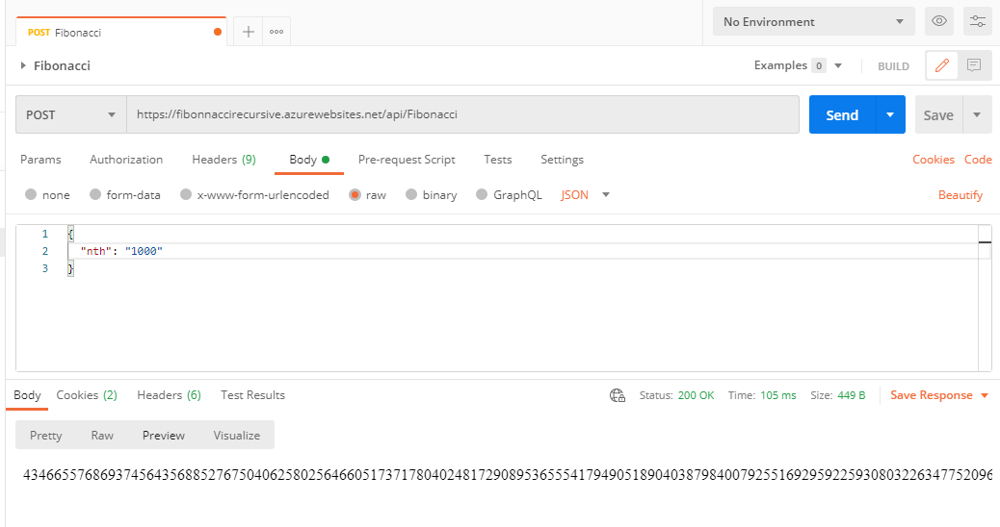

### Escuela Colombiana de Ingeniería
### Arquitecturas de Software - ARSW

## Escalamiento en Azure con Maquinas Virtuales, Sacale Sets y Service Plans

### Dependencias
* Cree una cuenta gratuita dentro de Azure. Para hacerlo puede guiarse de esta [documentación](https://azure.microsoft.com/en-us/free/search/?&ef_id=Cj0KCQiA2ITuBRDkARIsAMK9Q7MuvuTqIfK15LWfaM7bLL_QsBbC5XhJJezUbcfx-qAnfPjH568chTMaAkAsEALw_wcB:G:s&OCID=AID2000068_SEM_alOkB9ZE&MarinID=alOkB9ZE_368060503322_%2Bazure_b_c__79187603991_kwd-23159435208&lnkd=Google_Azure_Brand&dclid=CjgKEAiA2ITuBRDchty8lqPlzS4SJAC3x4k1mAxU7XNhWdOSESfffUnMNjLWcAIuikQnj3C4U8xRG_D_BwE). Al hacerlo usted contará con $200 USD para gastar durante 1 mes.

### Parte 0 - Entendiendo el escenario de calidad

Adjunto a este laboratorio usted podrá encontrar una aplicación totalmente desarrollada que tiene como objetivo calcular el enésimo valor de la secuencia de Fibonnaci.

**Escalabilidad**
Cuando un conjunto de usuarios consulta un enésimo número (superior a 1000000) de la secuencia de Fibonacci de forma concurrente y el sistema se encuentra bajo condiciones normales de operación, todas las peticiones deben ser respondidas y el consumo de CPU del sistema no puede superar el 70%.

### Escalabilidad Serverless (Functions)

1. Cree una Function App tal cual como se muestra en las  imagenes.

2. Instale la extensión de **Azure Functions** para Visual Studio Code.

3. Despliegue la Function de Fibonacci a Azure usando Visual Studio Code. La primera vez que lo haga se le va a pedir autenticarse, siga las instrucciones.

4. Dirijase al portal de Azure y pruebe la function.

5. Modifique la coleción de POSTMAN con NEWMAN de tal forma que pueda enviar 10 peticiones concurrentes. Verifique los resultados y presente un informe.

>Se hicieron 10 peticiones recurrentes y los resultados de cada una de las peticiones fue la siguiente:

> 

>Las 10 requests que se hicieron a la Azure Function fueron realizadas de la manera correcta.

6. Cree una nueva Function que resuleva el problema de Fibonacci pero esta vez utilice un enfoque recursivo con memoization. Pruebe la función varias veces, después no haga nada por al menos 5 minutos. Pruebe la función de nuevo con los valores anteriores. ¿Cuál es el comportamiento?.

>

>Una vez se consultan las mismas que se habian calculado previamente, la función responde mas lento, esto se debe al algoritmo que se uso para solucionar Fibonacci.

>

>

>

**Preguntas**

* ¿Qué es un Azure Function?

> Azure function ayuda a ejecutar partes de codigo de manera eficiente o funciones en la nube sin preocuparce de la arquitectura de la implementacion
Functions es una gran solución para procesar datos masivos, integrar sistemas, trabajar con Internet de las cosas (IoT) y crear API y microservicios simples.

* ¿Qué es serverless?

> Es la abreviacion de computacion sin servidor, En este se encarga algun proveedor en la nube de desplegar la funcion o el fragmento de codigo asignando de manera dinamica los recursos
aveces se denomina Funcion como servicio "FaaS"

* ¿Qué es el runtime y que implica seleccionarlo al momento de crear el Function App?

>Runtime es la infraestructuta de azure utilizada para proporcionar Flujo de datos, movimiento de datos, envio de actividades y  ejecucion de paquetes en diferentes entornos de red
Esto es proporcionado para procesos sin servidor, existen 3 tipos de IR:
    - Azure
    - Autohospeado
    - Azure-SSIS

* ¿Por qué es necesario crear un Storage Account de la mano de un Function App?

>Azure Functions requiere una cuenta de Azure Storage cuando crea una instancia de aplicación de función.
esta puede usar servicios como:
    
>- Alamcenamiento de blobs de azure: esta es para mantener el estado de los enlaces y las tclas de funciones
>- Archivos de Azure: este es para alamcenar y ejecutar codigo de la funcion
>- Almacenamiento en cola: esto es usado por centros de tareaas en funciones durable 
>- Almacenamiento de tablas: igual que el anterior

* ¿Cuáles son los tipos de planes para un Function App?, ¿En qué se diferencias?, mencione ventajas y desventajas de cada uno de ellos.

> Existen 3 tipos de planes:

> **Plan de consumo** : Azure proporciona todos los recursos de cálculo necesarios. No tiene que preocuparse de la administración de recursos y solo paga por el tiempo que haya empleado en la ejecución del código.

> **Plan Premium** : especifique un número de instancias activadas previamente que siempre están en línea y preparadas para responder de inmediato. Cuando se ejecuta la función, Azure proporciona todos los recursos informáticos adicionales que sean necesarios. Se paga tanto por las instancias activadas previamente que se ejecutan de forma continua como por todas las instancias adicionales que se usen cuando Azure reduce y escala horizontalmente la aplicación.

> **Plan de App Service** : se ejecutan las funciones igual que aplicaciones web. Si ya usa App Service para las otras aplicaciones, las funciones pueden ejecutarse en el mismo plan sin costo adicional.

* ¿Por qué la memoization falla o no funciona de forma correcta?

> Azure despues de que el proceso dura quito mas de 5 minutos lo que hace es eliminar cosas de la memoria entonces lo que se tenia de memoria se pierde y con esto los datos que ya calcuclamos, este es el problema de que falle o no falle

* ¿Cómo funciona el sistema de facturación de las Function App?

> Functions se factura según el consumo de recursos observado, medido en gigabytes por segundos (GB-s). El consumo de recursos observado se calcula multiplicando el tamaño medio de memoria en GB por el tiempo en milisegundos que dura la ejecución de la función. La memoria que una función utiliza se mide redondeando al alza a los 128 MB más cercanos hasta un tamaño de memoria máximo de 1.536 MB, y el tiempo de ejecución se redondea al alza a los 1 ms más cercanos. Para la ejecución de una única función, el tiempo de ejecución mínimo es de 100 ms y la memoria mínima es de 128 MB, respectivamente. Los precios de Functions incluyen una concesión gratuita al mes de 400.000 GB-segundos.
* Informe
